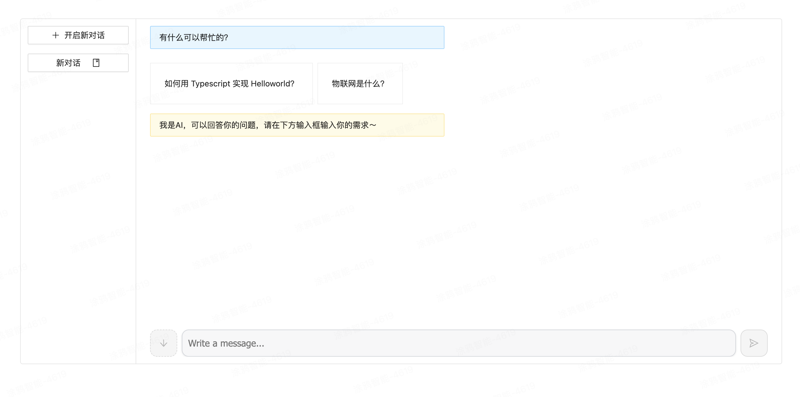
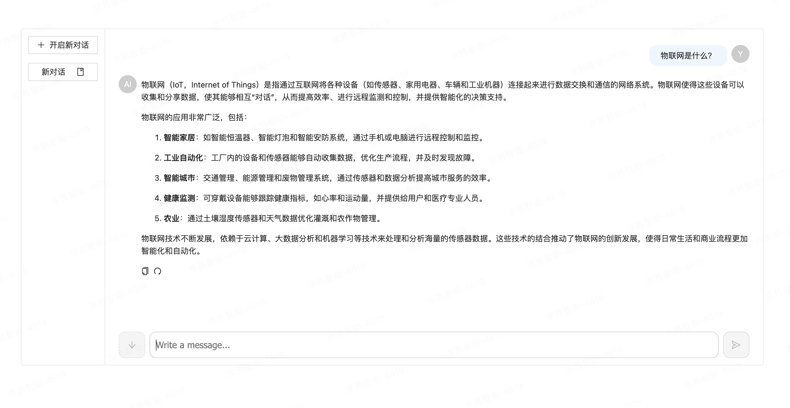

### 我的 GPT UI

理解和熟悉 assistant-ui。或快速定制你的 Gpt UI 可使用本模版。

### 预览




### 开始

启动前，项目下新建 `.env` 文件，新增变量：

```sh
GPT_API_FRONTEND=前端请求API代理域名
GPT_API_BACKEND=GPT私有服务域名
GPT_TOKEN=GPT密钥
```

启动服务

```sh
yarn install

yarn dev
```